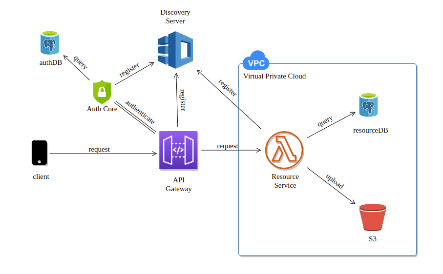

# BazaarCore

<hr/>

## Table of Contents

- [Introduction](#introduction)
- [Prerequisites](#prerequisites)
- [Installation](#installation)
- [Conclusion](#conclusion)

<hr/>

## Introduction

Microservice backend architecture supporting the UstBazaar project is designed to provide a scalable and efficient infrastructure for the mobile application. Written in Kotlin, UstBazaar is a platform specifically catering to HKUST students, enabling them to trade and exchange items.

In this architecture, the backend system is divided into smaller, loosely coupled microservices, each responsible for a specific functionality or feature. These microservices can be developed, deployed, and scaled independently, allowing for easier maintenance and flexibility.

Here's the diagram:



<hr/>

## Prerequisites

- JDK 17
- Docker

<hr/>

## Installation

### Clone the repo
```sh 
git clone git@github.com:Pat-r1ck/bazaarCore.git
```

### Change directory to project folder
```sh 
cd bazaarCore
```

### Edit environment file
```sh 
echo "JWT_SECRET_KEY=secret" > .env
echo "ACCESS_AWS_KEY=access_key" > .env
echo "SECRET_AWS_KEY=secret_key" > .env
```

### Start Postgresql databases
```sh 
docker-compose up -d
```

### Start Discovery Server
```sh 
mvn -f discovery-server spring-boot:run
```

### Start Auth Core
```sh 
mvn -f auth-core spring-boot:run
```

### Start API Gateway
```sh 
mvn -f gateway spring-boot:run
```

### Start Resources Service
```sh 
mvn -f resources-service spring-boot:run
```
<hr/>

## Conclusion

In conclusion, the microservice backend architecture implemented for the UstBazaar project is a robust and scalable solution that caters specifically to HKUST students seeking to trade and exchange items. By dividing the backend system into smaller, independent microservices, the architecture allows for flexibility, easier maintenance, and efficient scaling.